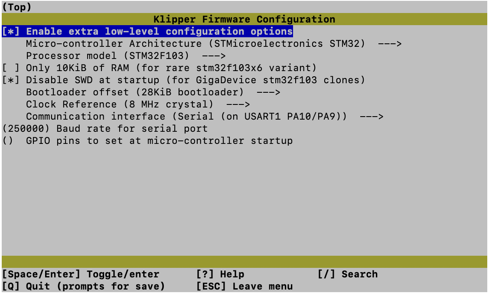

# Ender 3 Klipper Configuration

This repository is an archive of my Ender 3 firmware and configuration files. 

The repo is public in the spirit of open source software, but I make no guarantees about compatibility with your printer. Use at your own risk.

# Klipper Build Settings

My Ender 3 came from the factory with a Creality v4.2.2 board with the GD32F303 microcontroller. This chip isn't officially supported by Klipper, but I found that the below configuration worked with my printer. Settings not listed were left at the Klipper defaults.

Others have reported similar configurations working, but with different communication interfaces. It's possible that even if you have the same board, you would need to use a different interface. Experiment a little.

|Setting|Value|
|-|-|
|Microcontroller Architecture|STM32|
|Disable SWD at startup|Checked|
|Bootloader offset|28KiB bootloader|
|Communications interface|Serial on USART PA10/PA9|
|Baud rate for serial port|250000|

